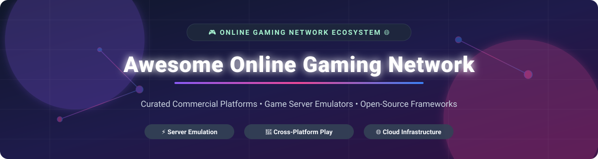

# Awesome-Online-Gaming-Network 🎮 🌐

  

  
  
  
  
  
  

---

## 🌟 Top Online Gaming Network Ecosystem 🚀

**Curated Directory of Commercial Gaming Networks & Open-Source Multiplayer Server Frameworks** 🎮  
*Focused on Online Multiplayer Platforms, Game Server Emulators, Backend Infrastructure, Social Features, Cloud Saves & Cross-Platform Play* 🌐  

**Last updated: October 2026** 📅

---

### 📌 Overview & SEO Summary 🔍
Welcome to the definitive, high-visibility curated directory of **online gaming networks**, **multiplayer game server emulators**, and **open-source game backend frameworks**. Whether you are researching established commercial gaming networks (such as *Xbox Network*, *PlayStation Network*, *Steam Community*, and *Epic Games Store*), or building self-hosted multiplayer infrastructure using top open-source projects (such as *Mindustry*, *OpenRA*, *Veloren*, *Nakama*, *Terasology*, and *OpenTTD*), this repository delivers comprehensive technical and economic benchmarks.

---

## 📑 Table of Contents
- [🏢 SaaS & Commercial Platforms](#-saas--commercial-platforms)
- [🔓 Open-Source GitHub Projects](#-open-source-github-projects)
- [🛠️ How to Contribute](#%EF%B8%8F-how-to-contribute)
- [📊 Star History](#-star-history)
- [🤝 Support & Sponsorship](#-support--sponsorship)
- [⚠️ Disclaimer](#%EF%B8%8F-disclaimer)

---

## 🏢 SaaS / Commercial Platforms 🏬

> **Market Insights & Industry Dynamics:** 📈  
> The global online gaming network and multiplayer backend infrastructure sector is estimated at **$28.5 Billion** in annual market size as of 2026. The market is **highly concentrated (winner-take-all dynamics)** around platform monopolies (Microsoft Xbox Network, Sony PlayStation Network, Nintendo Switch Online, Valve Steam), where network effects, exclusive content, and identity lock-in concentrate over 85% of market revenue into top-tier platforms.

| SaaS / Commercial Platform | Company / Owner | Valuation / Market Cap | Standard Edition Starting Price | Free Tier / Free Trial Limits | Description |
| :--- | :--- | :--- | :--- | :--- | :--- |
| **[Xbox Network (Xbox Live)](https://www.xbox.com/live)** 🎮 | Microsoft | ~$3.90 Trillion | $9.99/month (Game Pass Core) | 7-day free trial for Game Pass Core; Free multiplayer access for free-to-play games | **Microsoft's gaming network** — online multiplayer, cloud saves, Game Pass library, cross-platform play between Xbox and PC. 🕹️ |
| **[Battle.net](https://www.blizzard.com/)** ⚔️ | Microsoft (Blizzard) | ~$3.90 Trillion | Free account creation; WoW sub starts at $14.99/month | Free to create account; Free-to-play titles (Overwatch 2, Hearthstone); WoW free trial up to level 20 | **Blizzard's gaming network** — World of Warcraft, Diablo, Overwatch, and Call of Duty. 🛡️ |
| **[PlayStation Network](https://www.playstation.com/psn/)** 🕹️ | Sony | ~$120 Billion | $9.99/month (PS Plus Essential) | 7-day free trial for PS Plus Premium/Extra; Free online multiplayer for free-to-play titles | **Sony's online gaming service** — multiplayer access, monthly games, cloud saves, and game catalog. 🎮 |
| **[Nintendo Switch Online](https://www.nintendo.com/switch/online/)** 🍄 | Nintendo | ~$60 Billion | $19.99/year (Individual Plan) | 7-day free trial; Includes access to 207 classic NES, SNES, and Game Boy games | **Nintendo's online service** — online play, cloud saves, Nintendo Music app, and retro game libraries. 👾 |
| **[EA app](https://www.ea.com/ea-app)** ⚡ | Electronic Arts | ~$35 Billion | Free account creation; EA Play starts at $5.99/month | Free account creation; EA Play 10-hour trial for select new releases | **EA's PC gaming platform** — replaces Origin, integrates with Steam. EA Play offers 10-hour trials and 10% purchase discounts. ⚽ |
| **[Epic Games Store](https://store.epicgames.com/)** 🚀 | Epic Games | ~$14.28 Billion | Free account creation | Free weekly game claims (keep forever); 100% free account access | **Fortnite creator's PC storefront** — free games program, exclusive titles, and Unreal Engine integration. 🏆 |
| **[Steam Community](https://store.steampowered.com/)** 💨 | Valve Corporation | ~$10 Billion | Free account creation | Free account access (limited until $5 spent on account to prevent spam); Free-to-play game library | **The dominant PC gaming platform** — 40M+ concurrent users, community features, workshop mods, and extensive library. 💻 |
| **[Riot Games Network](https://www.riotgames.com/)** 🔫 | Riot Games (Tencent) | ~$7.6 Billion | Free account creation | Free to play all games (League of Legends, Valorant, TFT) with no mandatory subscriptions | **Riot's gaming ecosystem** — League of Legends, Valorant, Teamfight Tactics, and Legends of Runeterra. 🎯 |
| **[Ubisoft Connect](https://ubisoftconnect.com/)** 🏰 | Ubisoft | ~$1.09 Billion | Free account creation; Ubisoft+ starts at $17.99/month | Free account creation; Periodical free weekend trials for full AAA games | **Ubisoft's gaming ecosystem** — cross-platform progression, rewards, and in-game challenges. 🗡️ |
| **[GOG Galaxy](https://www.gog.com/galaxy)** 🌌 | CD Projekt / Michał Kiciński | ~$25 Million | Free account creation | Free account access; DRM-free offline backup installers included | **DRM-free gaming platform** — curated catalog, no DRM, offline installers. 📦 |

---

## 🔓 Open-Source GitHub Projects 🛠️

*Sorted by GitHub_Stars_Count (Descending)* 🌟

- **[Mindustry (Anuken/Mindustry)](https://github.com/Anuken/Mindustry)**   
  **Open-source tower defense and RTS with online multiplayer**, GPL-3.0 licensed. Supports online co-op, cross-platform play, and custom dedicated servers. Built in Java/Kotlin. 🏭

- **[Nakama (heroiclabs/nakama)](https://github.com/heroiclabs/nakama)**   
  **Distributed server engine for social and realtime multiplayer games**, Apache-2.0 licensed. Includes authentication, user profiles, chat, leaderboards, matchmaker, and realtime sync in Go. ⚡

- **[OpenRA (OpenRA/OpenRA)](https://github.com/OpenRA/OpenRA)**   
  **Open-source real-time strategy game engine**, GPL-3.0 licensed. Modern multiplayer engine supporting Command & Conquer, Red Alert, and Dune 2000 with online lobbies. ⚙️

- **[Lutris (lutris/lutris)](https://github.com/lutris/lutris)**   
  **Open-source open gaming platform manager for Linux**, GPL-3.0 licensed. Integrates multiple online gaming networks (Steam, GOG, Epic) into a unified launcher. 🐧

- **[Veloren (veloren/veloren)](https://github.com/veloren/veloren)**   
  **Open-source multiplayer voxel RPG in Rust**, GPL-3.0 licensed. Features dedicated server hosting, persistent multiplayer worlds, trading, and combat. 🏔️

- **[Endless Sky (endless-sky/endless-sky)](https://github.com/endless-sky/endless-sky)**   
  **Open-source 2D space trading and combat game**, GPL-3.0 licensed. High-star C++ engine with community server and multiplayer extensions. 🚀

- **[OpenTTD (OpenTTD/OpenTTD)](https://github.com/OpenTTD/OpenTTD)**   
  **Open-source transport simulation game with dedicated server multiplayer**, GPL-2.0 licensed. Classic competitive multiplayer gaming network. 🚂

- **[SuperTuxKart (supertuxkart/stk-code)](https://github.com/supertuxkart/stk-code)**   
  **Open-source 3D kart racing game with online multiplayer**, GPL-3.0 licensed. Includes WAN and LAN multiplayer modes with global master server lobby. 🏎️

- **[Terasology (MovingBlocks/Terasology)](https://github.com/MovingBlocks/Terasology)**   
  **Extensible open-source voxel game framework with multiplayer**, Apache-2.0 licensed. Modular Java backend architecture with dedicated multiplayer server support. 🌍

- **[Xonotic (xonotic/xonotic)](https://github.com/xonotic/xonotic)**   
  **Fast-paced open-source arena FPS with dedicated servers**, GPL-3.0 licensed. Community master server infrastructure and server browser. 🔫

- **[due (dobyte/due)](https://github.com/dobyte/due)**   
  **Lightweight distributed game server framework in Go**, MIT licensed. Gate/Node/Mesh architecture supporting TCP, WebSocket, and RPC game servers. 🎮

- **[Forgotten Server (gesior/forgottenserver-gesior)](https://github.com/gesior/forgottenserver-gesior)**   
  **Open-source MMORPG server emulator in C++**, GPL-2.0 licensed. High performance Open Tibia server software for custom MMORPG deployments. ⚔️

- **[OTClient (opentibiabr/otclient)](https://github.com/opentibiabr/otclient)**   
  **Open-source alternative client for MMORPG servers**, MIT licensed. Written in C++ and Lua, offering modular networking and UI rendering. 🖥️

- **[MyAAC (slawkens/myaac)](https://github.com/slawkens/myaac)**   
  **Automatic Account Creator web portal for game server emulators**, GPL-3.0 licensed. Management panel for player accounts, guilds, and high scores. 🌐

- **[Atlas (atlas-kit/atlas)](https://github.com/atlas-kit/atlas)**   
  **Open-source MMORPG server emulator suite**, GPL-3.0 licensed. Modular C++ framework for high-concurrency multiplayer server clusters. 🗺️

- **[OTX Server (FeTads/otxserver)](https://github.com/FeTads/otxserver)**   
  **Community-maintained game server distribution**, GPL-2.0 licensed. Custom server core tailored for retro MMORPG game networks. 🔧

---

## 🛠️ How to Contribute 🤝

Contributions are greatly appreciated! To add or update online gaming platform entries or open-source game servers:

1. 🍴 **Fork** this repository.
2. 📝 **Edit** `README.md` following the exact table or list formatting.
3. 🔗 Ensure all open-source repositories include project name, stargazers link badge, license, and brief description.
4. 🚀 Submit a clean **Pull Request** detailing your additions.

---

## 📊 Star History 📈

---

## 🤝 Support & Sponsorship ☕

If you find this online gaming network ecosystem directory helpful, please consider supporting the project:

- ⭐ **Star** this repository to help others discover it!
- 🔀 **Fork** and share with fellow developers, game designers, and server admins.
- 💖 **Sponsor & Buy Me a Coffee**: Support ongoing open-source curation via the [GitHub Sponsor Dashboard](https://github.com/sponsors/ishandutta2007).

Thank you for supporting open source gaming software and multiplayer network infrastructure!  

---

## ⚠️ Disclaimer 🔒

- This repository is a **community-curated list** for informational and educational purposes only. ℹ️
- Third-party SaaS products (Xbox Network, PSN, Steam, EA app) collect telemetry and require terms-of-service compliance. 🛡️
- Self-hosted open-source game servers require proper security configuration, firewall rules, and DDoS protection before public deployment. 🎮

---

  <b>Made with ❤️ for game developers, multiplayer server hosters, and open-source gaming communities.</b>

